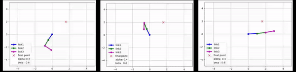
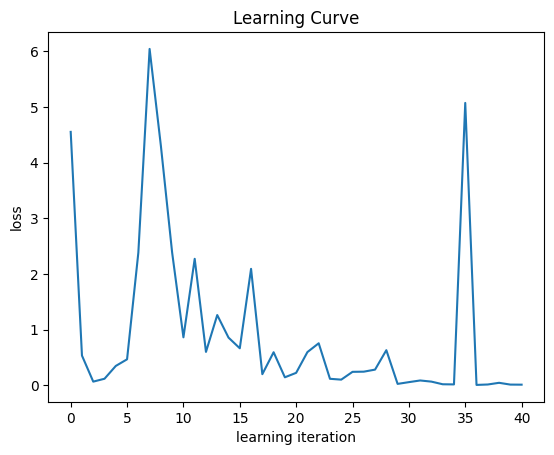

In this project, we are going to control it by simulating a 3-degree-of-freedom robot with deep reinforcement learning methods
let's pay First, it is assumed that we have a screen robot and we want the final execution of the robot arm from the starting point to the target point
reach In this exercise, it is assumed that the start and end points do not change in each episode

   
  star if you like it ✨
   
   
   
   

  
   
     
  

